# WIM（动态承重系统）数据分析报告

## 1. 总体车辆类型占比分析

**分析方法：** 使用Python的`csv`和`matplotlib`库读取`WIMData.csv`文件，统计所有车辆类型（A-I类）的数量，并绘制总体占比饼图。

**分析图表：**
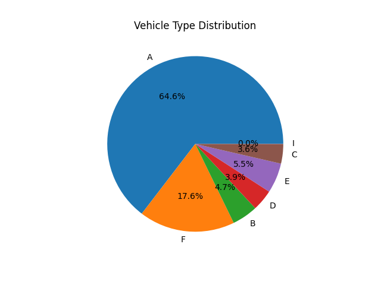

**主要结论：** A类车（小客车）在长途交通中占比最高（约65%）。其次是F类车（特大型货车，约18%），这说明该桥梁不仅是民用交通枢纽，也是重要的货运通道。

---

## 2. 各车道内车辆类型占比分析

**分析方法：** 对每个车道分别统计各车型的占比，为6个车道分别绘制饼图，并进行横向对比。

**分析图表及对应特点：**
- **边道（Lane 1, Lane 6）**：
  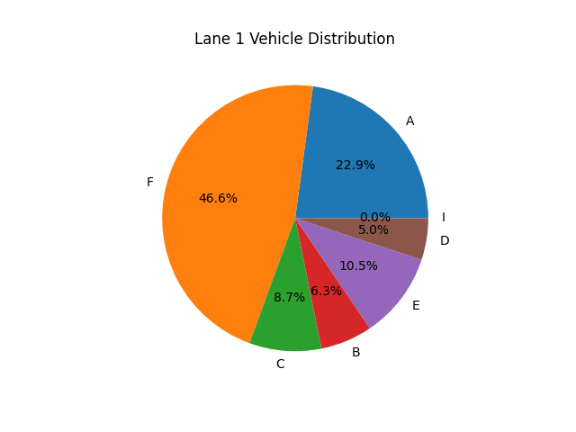 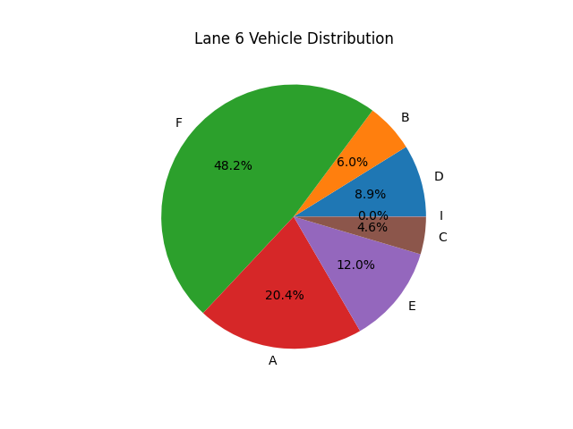
  *特点分析：* 边道中A类车比例明显下降（30-40%左右），而F类特大型货车比例显著上升，甚至成为最主要车型。此外，这两个车道囊括了较多的E类等多轴重型货车。
  
- **中道（Lane 2-5）**：
  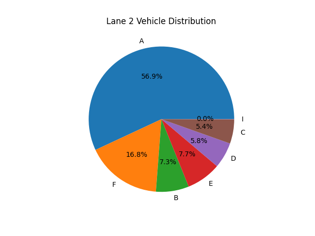 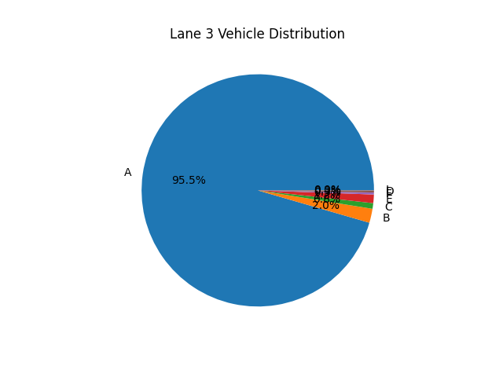
  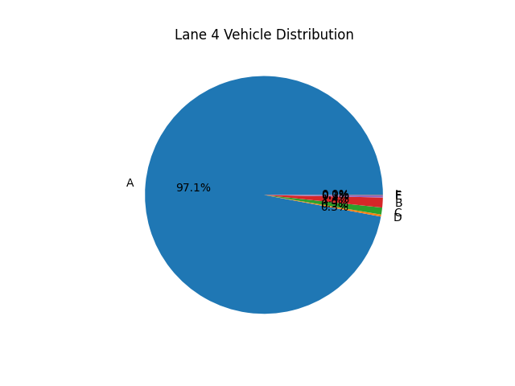 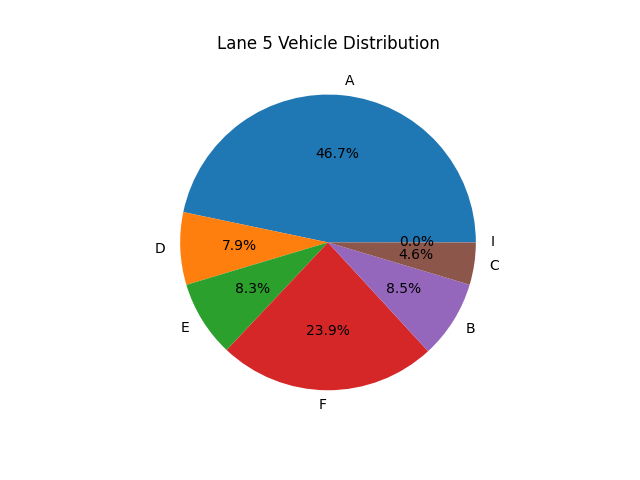
  *特点分析：* 车道2、3、4、5的A类小客车占比具有绝对优势（远超80%）。这表现出该桥梁收费站具有非常明确的**"客货分流"**调度机制。重载慢速车辆被引导至两侧边道，以保证中间车道快速小客车（如ETC通道）的通行效率。

---

## 3. 两个方向车流量对比分析

**分析方法：** 将车道1~3合并为"方向1"，车道4~6合并为"方向2"，通过Python词典进行累加并对比。

**对比表格：**
| 车型 | 方向1 (1-3车道) | 方向2 (4-6车道) | 差值与规律 |
|-----|----------------|----------------|-----------|
| **A (小客车)**| 388,164        | 365,721      | 方向1略多 |
| **B (小型货车)**| 29,200       | 26,029       | 基本相当 |
| **C (大客车)**| **25,663**     | **16,368**   | **方向1显著较多(约1.5倍)** |
| **D (中型货车)**| 19,954       | 25,778       | 方向2略多 |
| **E (大型货车)**| 33,928       | 30,652       | 基本相当 |
| **F (特大货车)**| 101,882      | 103,456      | 高度一致 |
| **I (其他)**  | 103            | 30           | 数量极少 |
| **总计**      | **598,894**    | **568,034**  | **总量基本平衡** |

**数据分析：** 两个方向的总流量大体相当（约60万对57万），货运车流（F类）在两个方向甚至高度一致（10万辆）。
但值得注意的是，**C类（大客车）出现明显的方向性偏差**，方向1是方向2的1.5倍。这说明该大桥连接的两端可能有城际客流的不对称性（例如早高峰进城、晚高峰出城，或某一端是主要的客运枢纽）。

---

## 4. 车重规律分析

**分析方法：** 提取各车道的`TotalWeight`（车辆总重），计算每个车道的平均值、最大值和最小值，绘制点线对比图。

**分析图表：**
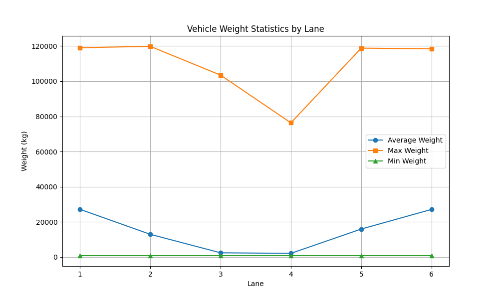

**规律与意义：**
1. **规律：** 车道的平均承重呈现明显的**"两头高、中间低"**（U型槽）规律。车道1和车道6的平均承重远远高于中间的2-5车道。
2. **最大/小值差异：** 所有车道都存在极轻和极重的极端值，这可能对应了空载微型车和超载重型卡车。
3. **意义：** 此分析对桥梁养护意义重大。道路1和6（边侧车道）长期承受巨大的动载荷压力。因此，在道路设计、材料铺设和日常翻修中，需对边车道实施更严标准的加固处理，重点排查其疲劳性损耗。

---

## 5. 每小时车流量规律（日内分析）

**分析对象：** 选取2024-03-05这一完整24小时数据的日期。

**分析图表：**
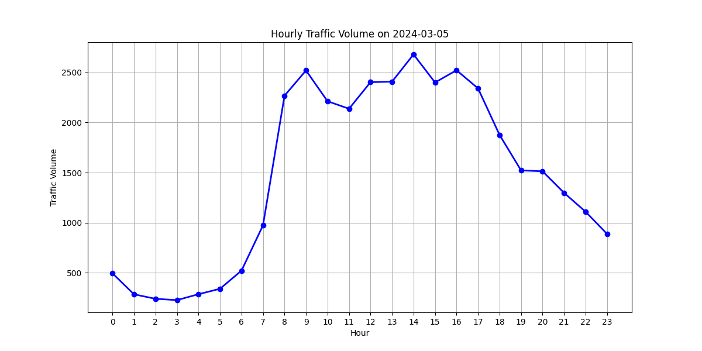

**规律发现：**
图表揭示了非常典型的公路日常通勤规律：
- **低谷期**：凌晨2:00-4:00车流量最低。
- **早高峰**：清晨6:00后流量骤增，8:00左右达到早高位。
- **白日平稳及最高峰**：整个白天（8:00至17:00）维持在高通量运转。其中，下午14:00为全日车流的绝对最高峰。
- **夜间回落**：18:00后车流迅速持续断崖式下跌。

---

## 6. 【选做任务】工作日与双休日车流量对比

**分析方法：** 将日期映射为星期(0-4为工作日，5-6为双休日)，汇总分析总流量和分车型流量的时间分布。

**总体对比图：**
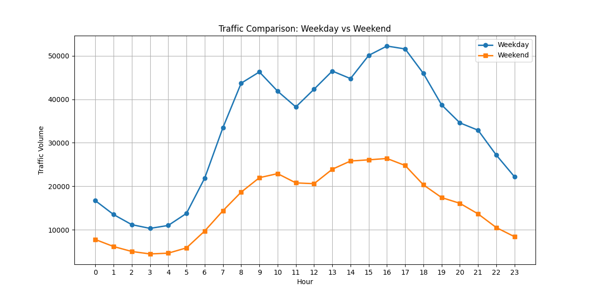

**各车型工作日情况：**
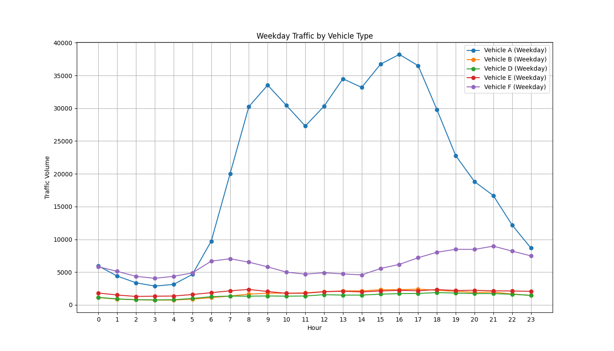

**各车型双休情况：**
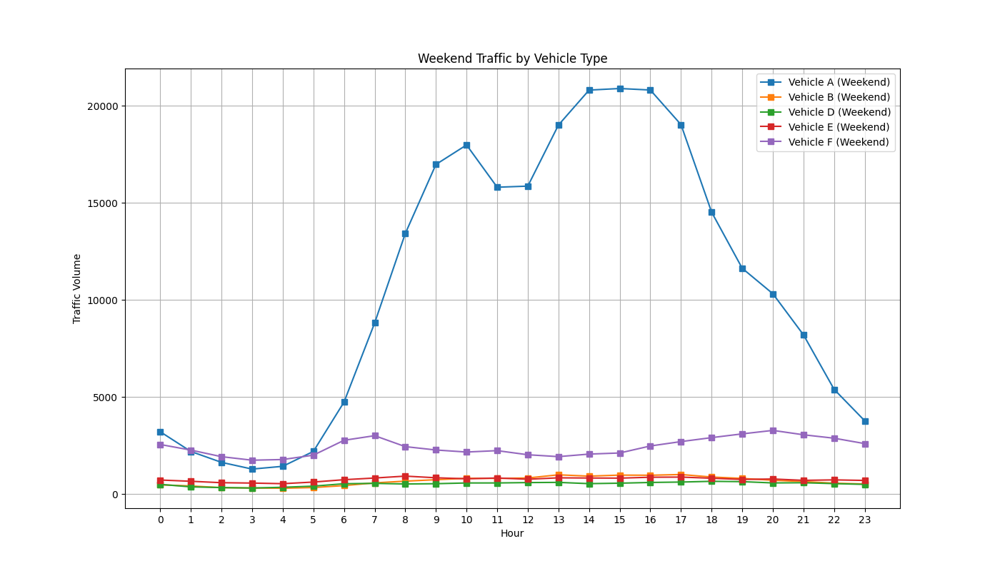

**深度规律分析：**
1. **总量形态差异**：工作日曲线有清晰的"早、晚、午"多重波峰形态，通勤特征明显；而双休日的车流爬升更晚（早高峰推迟至9-10点开始），白日呈现为一个饱满的"单峰曲线"，表明双休日以休闲自驾游为主，时间相对集中。
2. **车型分化明显（重要发现）**：
   - A类车（小客车）：主导了双休日的车流量波峰，完美贴合单峰休闲特征。
   - F等重型货运车：在工作日和双休日的曲线上表现出了极强的**稳定性**和**低波动性**。无论早晚，大货车的通行量受节假日影响很小。这说明跨城大宗物流是不停歇的。