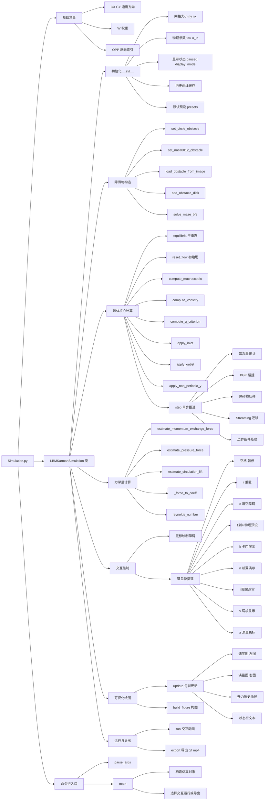

# LBM中升力计算与元胞自动机原理

## 1. 目标与符号约定

本项目在D2Q9 LBM框架下，同时输出三条升力系数曲线：

- `Cl (MEM)`：动量交换法（Momentum Exchange Method）
- `Cl (Pressure)`：压力积分法
- `Cl (Gamma)`：环量法（Kutta-Joukowski）

当前可视化默认沿用网格坐标符号（数组行索引向下）。

如果在报告中采用“物理向上为正升力”，可在后处理统一换算：

$$
F_y^{phys} = -F_y^{grid}, \qquad C_L^{phys} = -C_L^{grid}.
$$

---

## 2. LBM基本方程（BGK, D2Q9）

### 2.1 演化方程

在格点 `x`、离散方向 `i` 上，粒子分布函数满足：

$$
f_i(\mathbf{x}+\mathbf{c}_i\Delta t,t+\Delta t)-f_i(\mathbf{x},t)
=-\frac{1}{\tau}\left[f_i(\mathbf{x},t)-f_i^{eq}(\mathbf{x},t)\right].
$$

其中：

- $\tau$ 为松弛时间
- $f_i^{eq}$ 为局部平衡分布

### 2.2 宏观量恢复

$$
\rho = \sum_i f_i,
\qquad
\rho \mathbf{u} = \sum_i f_i \mathbf{c}_i.
$$

LBM格单位下运动黏度：

$$
\nu = c_s^2\left(\tau-\frac{1}{2}\right), \quad c_s^2=\frac{1}{3}
\Rightarrow
\nu=\frac{\tau-0.5}{3}.
$$

---

## 3. 第一条线：动量交换法（MEM）

## 3.1 物理思想

障碍物边界采用bounce-back时，流体在边界处发生动量反转。对每条“流体-固体链接”累积动量变化，即可得到流体对固体的力。

对方向 `i` 的局部贡献可写为：

$$
\Delta \mathbf{F}_i \propto 2 f_i \mathbf{c}_i.
$$

全边界求和得总力：

$$
\mathbf{F}_{MEM}=\sum_{\text{fluid-solid links}}2f_i\mathbf{c}_i.
$$

### 3.2 升力系数

记网格坐标下的纵向力为 $F_y$、流向力为 $F_x$，特征长度为 $D_c$（代码中取障碍物高度），则：

$$
C_D = \frac{F_x}{\frac{1}{2}\rho_{ref}U_{in}^2D_c},
\qquad
C_L = \frac{F_y}{\frac{1}{2}\rho_{ref}U_{in}^2D_c}.
$$

若采用“物理向上为正”，再按第1节执行符号换算。

### 3.3 数值特征

- 对瞬时变化敏感，能较快反映涡脱落频率
- 对网格锯齿边界和局部噪声更敏感，曲线可能略抖

---

## 4. 第二条线：压力积分法

## 4.1 物理思想

低马赫数LBM里，压力近似：

$$
p = c_s^2\rho = \frac{\rho}{3}.
$$

障碍物表面力由压力对法向积分得到：

$$
\mathbf{F}_{p} = -\oint_{\partial\Omega} p\,\mathbf{n}\,dS.
$$

离散上通过边界梯度估计法向，近似求和。

### 4.2 数值特征

- 物理解释直观
- 对法向估计质量和边界离散有依赖
- 往往比MEM平稳，但仍可能有高频波动

---

## 5. 第三条线：环量法（Gamma / Kutta-Joukowski）

## 5.1 连续理论

二维势流经典关系：

$$
L' = \rho U_\infty \Gamma,
\qquad
\Gamma = \oint_C \mathbf{u}\cdot d\mathbf{l}.
$$

其中 $L'$ 为单位展向升力，$C$ 为包围翼型/障碍物的闭合回路。

### 5.2 离散实现

代码在障碍物外围取矩形轮廓，沿四条边积分速度得到 `Gamma(raw)`。

### 5.3 去漂移（理论可选）

实际有粘性、出口边界、有限域和离散误差时，环量有时会出现慢漂移。若后续专门分析周期主频，可采用滑动基线去漂移：

$$
\Gamma' = \Gamma_{raw} - \overline{\Gamma}_{window}.
$$

再用：

$$
L'_{\Gamma} = \rho U_{in}\Gamma'.
$$

得到去漂移版本的 `Cl (Gamma)`。

### 5.4 数值特征

- 通常最平滑，适合看主频和相位
- 对积分轮廓和边界条件敏感
- 更适合趋势分析，不宜单独作为绝对升力唯一依据

---

## 6. 为什么三条线会“同频但不同相/不同幅”

卡门涡街主导下，三种方法都在测同一主导动力学，因此**频率通常一致**。

但它们观测的是不同物理投影：

- MEM：边界动量通量
- Pressure：边界法向压力载荷
- Gamma：外层闭合环路环量

因此会出现：

- 同频（同一涡脱落频率）
- 相位略偏甚至符号相反（约定、离散、积分路径导致）
- 平滑度不同（Gamma通常更平滑）

---

## 7. 机翼工况与圆柱工况的差别

### 7.1 圆柱

理想对称情况下平均升力应接近0，主要表现为交替脱落引起的周期振荡。

### 7.2 有攻角机翼

有非零平均升力（曲线基线偏移）是正常现象；其上叠加周期振荡（分离/尾迹非定常）。

如果出现基线缓慢漂移，优先检查：

- Gamma是否使用去漂移
- 出口边界是否足够远
- 积分轮廓是否被尾迹强剪切区长期穿越

---

## 8. 结果解读建议（报告可直接引用）

- 周期与主频：优先看 `Cl (Gamma)` 与 `Cl (Pressure)`
- 幅值与平均值：优先看 `Cl (Pressure)`，并用 `Cl (MEM)` 交叉验证
- 如三条线频率一致、相位关系稳定，说明模拟物理一致性较好

---

## 9. 与代码实现对应

核心实现位于：

- `estimate_momentum_exchange_force()`：MEM力
- `estimate_pressure_force()`：压力积分力
- `estimate_circulation_lift()`：环量法
- `step()`：碰撞+迁移主更新
- `update()`：三条曲线统一计算与绘图

---

## 10. 元胞自动机核心：局部规则与同步更新

元胞自动机（Cellular Automaton, CA）的共同本质是：

> 每个元胞只根据自身和有限邻居的当前状态，通过局部规则同步计算下一时刻状态。

生命游戏与LBM都严格符合这一定义，只是“状态变量”和“转移规则”不同。

---

## 11. 从生命游戏到LBM：状态与邻域的对应

- 生命游戏：每个格子只有活/死两种状态
- LBM（D2Q9）：每个格子是9个方向分布函数 $f_0...f_8$
- 邻域结构：8方向邻居+中心静止态，本质上仍是有限局部邻域

这意味着LBM可以视为连续状态的CA（Continuous-state CA）。

---

## 12. 两步演化如何对应CA规则

每个时间步可拆成两个局部算子：

### 12.1 碰撞（Collision）

先统计宏观量：

$$
\rho = \sum_i f_i, \qquad \rho\mathbf{u} = \sum_i f_i\mathbf{c}_i,
$$

再执行BGK松弛：

$$
f_i^{*}=f_i-\frac{1}{\tau}(f_i-f_i^{eq}).
$$

这是“本元胞内部状态转换函数”，不需要求解全局线性系统。

### 12.2 迁移（Streaming）

$$
f_i(\mathbf{x}+\mathbf{c}_i\Delta t, t+\Delta t)=f_i^*(\mathbf{x},t).
$$

在代码中对应对每个方向执行 `np.roll`。从CA视角看，这是标准邻域映射：把本格信息传给相邻格。

---

## 13. 障碍物反弹规则的CA解释

无滑移边界使用Bounce-back：

$$
f_i(\mathbf{x}_{wall}) \leftarrow f_{opp(i)}(\mathbf{x}_{wall}).
$$

这本质上是“固体元胞”的局部规则表。它和普通流体元胞的规则不同，但仍是局部且同步更新。

---

## 14. 为什么会出现卡门涡街和迷宫穿流

系统中没有任何单元知道全局形状，每个元胞只重复执行：

1. 局部碰撞
2. 向邻居迁移
3. 碰到障碍物就反弹

大量迭代后，宏观上会涌现：

- 圆柱后方交替涡脱落（卡门涡街）
- 机翼升力与尾迹非定常振荡
- 迷宫中通路流动持续、死路逐渐衰减

这就是CA“局部规则驱动宏观结构”的典型例子。

---

## 15. 可视化图像的物理解释

在本项目的可视化中，两幅主图分别对应流场中的两个核心物理量：

- 左图：速度大小（Velocity Magnitude）
- 右图：涡量（Vorticity）

这两者分别回答两个不同的问题：

- 流体在什么地方“跑得快或慢”
- 流体在什么地方“发生旋转，以及旋转方向如何”

### 15.1 左图：速度大小

左图使用的是单向连续色带，当前代码里采用的是 inferno 风格配色。这种色带适合表示绝对值型标量场，即只有大小、没有正负方向之分的物理量。

速度大小定义为：

$$
|\mathbf{u}| = \sqrt{u_x^2 + u_y^2}.
$$

颜色含义如下：

- 亮橙色、黄色：高流速区
- 暗红色、紫色、近黑色：低流速区或滞止区

在绕流问题中，亮色通常出现在障碍物两侧。这是因为流体通过障碍物附近时，有效通道收缩，局部速度升高，形成加速带。

暗色通常出现在以下几个位置：

- 障碍物前方的驻点区：流体迎面撞上障碍物，速度降到接近0
- 障碍物表面附近：由于无滑移边界条件，壁面流速接近0
- 障碍物后方尾流区：流体在回流和大尺度旋涡影响下，整体前进速度下降

因此，左图本质上是“流体快慢分布图”。

### 15.2 右图：涡量

右图使用的是发散型双色带，当前代码里采用的是 seismic 风格配色。这类色带适合表示有正负之分的物理量。对于二维绕流问题，它表示的是涡量：

$$
\omega = \frac{\partial u_y}{\partial x} - \frac{\partial u_x}{\partial y}.
$$

涡量不是“速度有多大”，而是“局部流体微团旋转得有多强”。

颜色含义如下：

- 红色：正涡量，通常对应逆时针旋转
- 蓝色：负涡量，通常对应顺时针旋转
- 接近白色或浅色：局部旋转较弱

在圆柱或机翼绕流中，流体经过物体上下表面时会产生强剪切层。上下两侧剪切层的旋转方向相反，因此在尾迹中会逐渐形成红蓝相间的旋涡结构。

当这些旋涡交替脱落并向下游传播时，就形成了经典的卡门涡街。

### 15.3 为什么会看到红蓝交替

红蓝交替并不是配色上的巧合，而是尾流不稳定性在空间中的真实体现。

对圆柱而言：

- 上侧边界层分离后，往往卷起一类方向的旋涡
- 下侧边界层分离后，卷起相反方向的旋涡
- 两类旋涡交替脱落，于是在尾流中排成一串红蓝相间的结构

这就是卡门涡街最典型的视觉特征。

如果雷诺数较低，尾流仍保持稳定和对称，那么右图中就不会看到明显的红蓝交替长链，而只会看到较弱、较对称的局部旋转区。

---

## 16. 答辩时可直接使用的表述

可以直接这样介绍：

> 左图是速度云图，表示流体在各位置的速度大小。亮色说明局部流体加速，暗色说明存在壁面滞止、边界层减速或尾流低速区。右图是涡量图，表示流体微团的局部旋转强度和方向，红色和蓝色分别代表两种相反方向的旋转。圆柱尾迹中红蓝交替脱落的结构，正是卡门涡街在宏观上的可视化表现。

如果想更正式一点，也可以这样说：

> 左侧的橙紫图是速度大小场，反映了障碍物附近流体的加速和尾流中的减速；右侧的红蓝图是涡量场，展示了局部旋转结构的方向与强度。红蓝交替分布说明尾迹中存在周期性的交替旋涡脱落，这正是卡门涡街形成的直接证据。

---

## 17. 为什么低雷诺数下通常不出现卡门涡街

这是完全正常的物理现象。

卡门涡街并不是所有圆柱绕流都会自动出现，它要求尾流首先发生失稳。失稳的前提之一就是雷诺数达到一定范围。

雷诺数定义为：

$$
Re = \frac{U D}{\nu}.
$$

其中：

- $U$ 是特征来流速度
- $D$ 是障碍物特征长度
- $\nu$ 是运动黏度

在低雷诺数条件下，黏性效应占主导，流体内部的动量扩散能力很强，会不断抑制剪切层的不稳定增长。因此圆柱尾流通常保持：

- 近似对称
- 分离较弱
- 不发生交替旋涡脱落

从图像上看，表现为：

- 左侧速度图仍有尾流低速区，但整体较平滑
- 右侧涡量图只出现局部、较弱、近对称的红蓝区
- 不会形成向下游延伸的红蓝交替长链

只有当雷诺数提高到某个阈值以上，尾流中的上下剪切层才会失稳，开始交替卷起并周期性脱落，从而形成卡门涡街。

因此，在本项目中：

- 低雷诺数预设看不到明显卡门涡街，说明模型符合物理规律
- 中等雷诺数预设出现清晰红蓝交替尾迹，说明尾流失稳已被成功捕捉

### 17.1 在本代码中的对应关系

代码中雷诺数近似由以下关系给出：

$$
Re \sim \frac{u_{in} D}{\nu}, \qquad \nu = \frac{\tau - 0.5}{3}.
$$

因此：

- `u_in` 越小，$Re$ 越低
- `tau` 越大，黏性越大，$Re$ 越低
- 障碍物尺度越小，$Re$ 也会降低

所以如果在低速、大黏性参数下看不到涡街，不是程序失败，反而往往说明模拟结果是合理的。

### 17.2 可直接用于答辩的表述

> 低雷诺数条件下没有观察到卡门涡街是符合流体力学规律的。此时黏性耗散抑制了尾流失稳，障碍物后方虽然仍存在低速尾迹和局部旋转，但不会形成交替脱落的周期性旋涡链。只有当雷诺数增大到一定范围后，尾流剪切层失稳，才会出现典型的红蓝交替卡门涡街。

文档版本：2026-03-15

*** Add File: /Users/mike/Documents/University/Grade_1B/classes/Foundations of Autonomous Intelligence/Homework/3. 阶段1实践：自然界、生活、工程领域中的动态演变算法及实现/Simulation_Code_Mindmap.md
# Simulation.py 代码思维导图

下面这份 Mermaid 图是横版结构，适合直接插入 PPT 或导出截图。

## PPT 使用建议

如果你要放进 PPT，建议：

1. 直接用 VS Code Mermaid 预览后截图。
2. 若要更清晰，优先导出为 SVG 或高分辨率 PNG。
3. 答辩时按“常量定义 → 仿真类 → 单步更新 step → 可视化输出”这条主线讲，最清楚。
