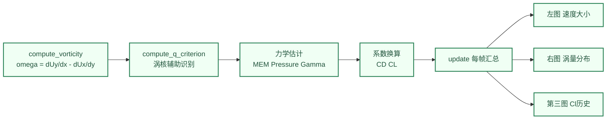

# 右中子图：物理量与可视化

```mermaid
flowchart LR
  classDef phys fill:#f0fff4,stroke:#2f855a,stroke-width:2px,color:#22543d;

  B0[compute_vorticity\nomega = dUy/dx - dUx/dy] --> B1[compute_q_criterion\n涡核辅助识别]
  B1 --> B2[力学估计\nMEM Pressure Gamma]
  B2 --> B3[系数换算\nCD CL]
  B3 --> B4[update 每帧汇总]
  B4 --> B5[左图 速度大小]
  B4 --> B6[右图 涡量分布]
  B4 --> B7[第三图 Cl历史]

  class B0,B1,B2,B3,B4,B5,B6,B7 phys
```
