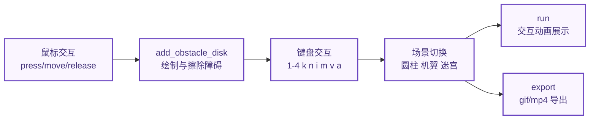

# 右下子图：交互与运行导出

```mermaid
flowchart LR
  classDef io fill:#faf5ff,stroke:#6b46c1,stroke-width:2px,color:#44337a;

  C0[鼠标交互\npress/move/release] --> C1[add_obstacle_disk\n绘制与擦除障碍]
  C1 --> C2[键盘交互\n1-4 k n i m v a]
  C2 --> C3[场景切换\n圆柱 机翼 迷宫]
  C3 --> C4[run\n交互动画展示]
  C3 --> C5[export\ngif/mp4 导出]

  class C0,C1,C2,C3,C4,C5 io
```
