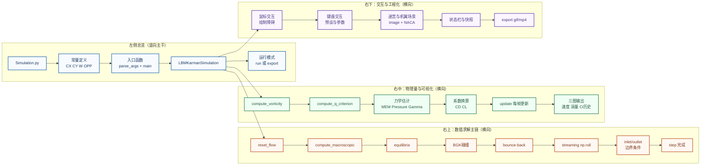

# Simulation.py 四联思维导图（左竖右三横）

```mermaid
flowchart LR
  classDef left fill:#f7fbff,stroke:#2b6cb0,stroke-width:2px,color:#1a365d;
  classDef solve fill:#fff8f2,stroke:#c05621,stroke-width:2px,color:#7b341e;
  classDef phys fill:#f0fff4,stroke:#2f855a,stroke-width:2px,color:#22543d;
  classDef io fill:#faf5ff,stroke:#6b46c1,stroke-width:2px,color:#44337a;

  subgraph LEFT[左侧总览（竖向主干）]
    direction TB
    L0[Simulation.py]
    L1[常量定义\nCX CY W OPP]
    L2[入口函数\nparse_args + main]
    L3[LBMKarmanSimulation]
    L4[运行模式\nrun 或 export]
    L0 --> L1 --> L2 --> L3 --> L4
  end

  subgraph A[右上：数值求解主链（横向）]
    direction LR
    A0[reset_flow]
    A1[compute_macroscopic]
    A2[equilibria]
    A3[BGK碰撞]
    A4[bounce-back]
    A5[streaming np.roll]
    A6[inlet/outlet\n边界条件]
    A7[step 完成]
    A0 --> A1 --> A2 --> A3 --> A4 --> A5 --> A6 --> A7
  end

  subgraph B[右中：物理量与可视化（横向）]
    direction LR
    B0[compute_vorticity]
    B1[compute_q_criterion]
    B2[力学估计\nMEM Pressure Gamma]
    B3[系数换算\nCD CL]
    B4[update 每帧更新]
    B5[三图输出\n速度 涡量 Cl历史]
    B0 --> B1 --> B2 --> B3 --> B4 --> B5
  end

  subgraph C[右下：交互与工程化（横向）]
    direction LR
    C0[鼠标交互\n绘制障碍]
    C1[键盘交互\n预设与参数]
    C2[迷宫与机翼场景\nimage + NACA]
    C3[状态栏与快照]
    C4[export gif/mp4]
    C0 --> C1 --> C2 --> C3 --> C4
  end

  L3 --> A0
  L3 --> B0
  L3 --> C0

  class L0,L1,L2,L3,L4 left
  class A0,A1,A2,A3,A4,A5,A6,A7 solve
  class B0,B1,B2,B3,B4,B5 phys
  class C0,C1,C2,C3,C4 io
```
